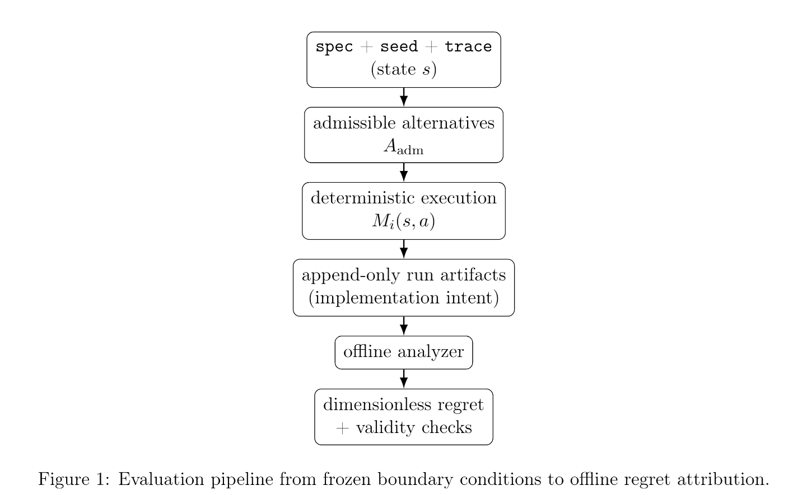

# Gedanken Engine for Regret Minimization

This repository is a spec-first evaluation and measurement engine for comparing decision policies in closed-system scenarios defined by the theory, with core execution and analyzer components as implementation intent. It is written for users who need audit-ready, unit-consistent, admissible counterfactuals. Deterministic replay plus an explicit audit trail matters in regulated or infrastructure settings because it makes counterfactual validity testable and failures reproducible.

## Why this exists

- Prevents invalid counterfactuals by enforcing causal closure and reset boundary conditions across alternatives (Section 2.1, Closed-System Assumption).
- Blocks clairvoyant baselines via comparator admissibility so regret measures decision quality instead of information advantage (Section 3.3, Best Admissible Alternative).
- Prevents unit-mixing scale bias by requiring nondimensionalization of multi-metric regret (Section 3.2 and 5.3, Conservation of Dimensionality).
- Stops nondeterministic replay through conservation of history so audits are reproducible (Section 5.1, Deterministic Replay).
- Prevents online learning contamination by enforcing offline isolation of measurement (Section 5.4, Offline Isolation).

## Core idea in one diagram



## Concepts translated

|        Theory term        | Engineering interpretation                                                              |
| :-----------------------: | --------------------------------------------------------------------------------------- |
|           $$s$$           | Boundary conditions: frozen workload trace, resettable environment state, and RNG seed. |
|           $$a$$           | Candidate designs or policies under evaluation.                                         |
|          $$M_i$$          | Measured metrics from replay, such as latency, throughput, energy, error rate.          |
|          $$C_i$$          | Normalization scales used to make each metric dimensionless before aggregation.         |
|        $$A_{adm}$$        | Admissible baselines that do not use hidden state or future RNG outcomes.               |
|         $$I(h)$$          | Observable information available at decision time.                                      |
|        $$regret$$         | Decision-quality delta relative to the best admissible alternative.                     |
|    $$causal closure$$     | Identical boundary conditions under replay for all alternatives.                        |
| $$nondimensionalization$$ | Unit-consistent aggregation of metrics into a dimensionless regret scalar.              |

## Correctness invariants (what we hard-fail on)

- Hard failure if deterministic replay breaks for fixed spec, seed, and trace; real systems lose the audit trail and cannot reproduce incident analysis.
- Hard failure if the trace or boundary conditions diverge across alternatives; real systems compare different workloads and yield invalid counterfactuals.
- Hard failure if dimensional consistency is violated by aggregating heterogeneous units without C_i(s); real systems embed scale bias and misleading tradeoffs.
- Hard failure if measurement is not offline and isolated; real systems mix evaluation with adaptation and hide regressions.
- Hard failure if the comparator uses hidden state or future RNG outcomes; real systems penalize agents for information they could not access.

## Minimal falsification scenario

Two agents each face one decision step with two actions. One agent has private information about an externality cost that the other cannot observe. A naive evaluator sets the comparator $$a^*$$ using that private information and then penalizes the other agent for not using it. This penalty is clairvoyance regret, meaning regret computed against an inadmissible comparator that uses hidden state or future RNG outcomes. We disallow it because it measures information advantage rather than decision quality and breaks counterfactual validity.

## Repository Layout

Mapping follows Theory Section 7 (Artifact Mapping).

- `theory/`: authoritative definitions and invariants. `specs/spec.md` applies the theory to scenario inputs.
- `specs/`: $$A$$ and $$A_{adm}$$ definitions, observation model $$I(h)$$, and $$C_i(s)$$ normalization choices.
- `traces/`: $$s$$ boundary conditions and immutable workload traces (implementation intent for append-only JSONL).
- `runs/<id>/`: gate artifacts such as `manager_tasks.yaml`, `manager_verdict.yaml`, and `agent*/out.yaml`.
- `runs/run-<id>-*.jsonl`: append-only execution logs from swarm utilities (implementation intent for audit trail).
- `runs/<id>/report.json`: offline regret artifact emitted by the analyzer (implementation intent).

## How to run (quick start)

Prereqs: Python 3.11, `uv`, and `codex` on PATH for swarm runs.

```bash
uv sync --dev
make gate
```

Optional swarm run that produces JSONL logs:

```bash
RUN_ID=1 make swarm
```

TODO placeholder for the core evaluation engine (not implemented yet):

```bash
# TODO: python -m src.runner --spec specs/<scenario>.yaml --trace traces/<trace>.jsonl --run-id <id>
```

Expected outputs at a high level:

- `make gate` reads `runs/demo/` and prints a JSON gate report with PASS or FAIL.
- `make swarm` writes `runs/run-<id>-manager.jsonl`, `runs/run-<id>-agent*.jsonl`, and `runs/run-<id>-swarm.jsonl`.
- Gate-ready runs live in `runs/<id>/` with `manager_tasks.yaml`, `manager_verdict.yaml`, and `agent*/out.yaml`.
- TODO: the offline analyzer will emit a regret report at `runs/<id>/report.json`.

## Verification checklist

- [ ] Re-run with identical spec, seed, and trace produces identical derived-state hashes.
- [ ] Trace files are immutable and identical across all alternatives.
- [ ] Comparator uses only $A_{adm}$ and excludes hidden state or future RNG outcomes.
- [ ] Every metric has an explicit $C_i(s)$ and aggregate regret is dimensionless.
- [ ] Changing units (ms to s) does not change dimensionless regret.
- [ ] Causal closure holds and boundary conditions reset between alternatives.
- [ ] Trace divergence triggers a hard failure.
- [ ] Measurement occurs offline with no online learning during execution.
- [ ] Regret is computed against the best admissible alternative, not clairvoyant baselines.
- [ ] Audit trail is reproducible from spec, seed, and trace alone.

## Relationship to agents

Repository positioning: the evaluation and measurement engine is authoritative, and agents are downstream consumers. Agents propose candidate actions or policies, while the ledger of spec, trace, and deterministic replay defines the source of truth and the system verifies admissibility and regret offline.

## References

- `theory/theory.pdf`

## License

See `LICENSE`.

## Citation

If you use or reference this repository, please cite:

```bibtex
@software{mcbride_2026_gedanken-engine-for-regret-minimization,
  author = {Michael McBride},
  title = {Gedanken Engine for Regret Minimization},
  year = {2026},
  url = {https://github.com/MichaelsEngineering/gedanken-engine-for-regret-minimization},
  version = {0.2}
}
```
